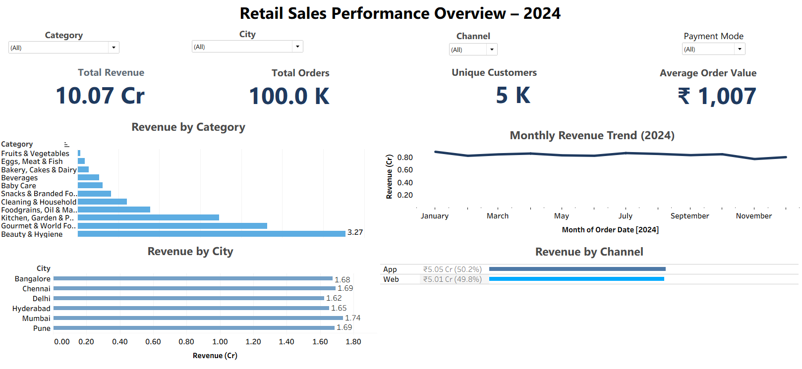
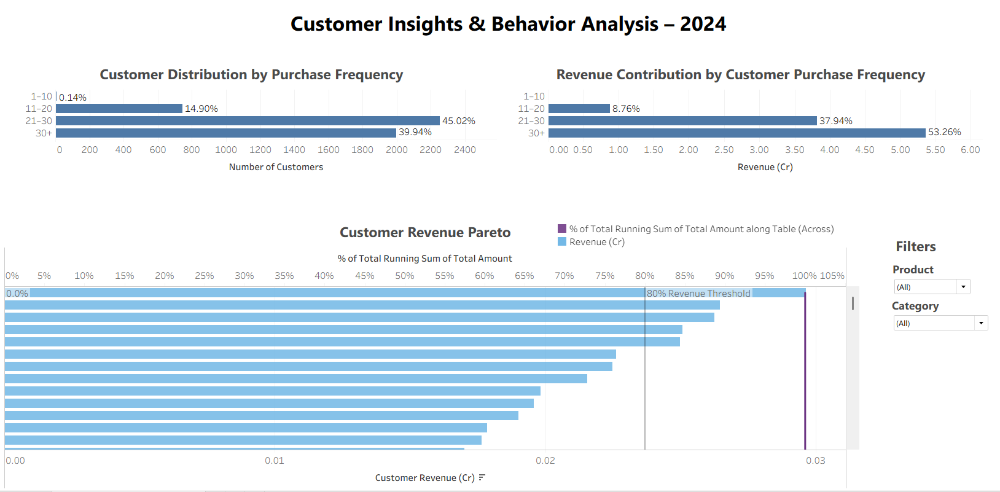

# Retail Sales & Customer Analytics Project

This project analyzes retail sales performance and customer purchasing behavior using a simulated retail transaction dataset inspired by Blinkit-style grocery product categories. The objective is to uncover insights related to customer purchase patterns, product category performance, and revenue contribution across different customer segments.

The analysis combines **Python, SQL, and Tableau** to perform data cleaning, exploratory analysis, and interactive dashboard visualization.

---

## Business Problem
Retail businesses need to understand customer purchasing behavior and product performance in order to optimize inventory, improve marketing strategies, and increase revenue.

This project aims to answer key questions such as:
- Which product categories generate the highest revenue?
- How does customer purchase frequency impact revenue contribution?
- Are there high-value customer segments that drive the majority of sales?

---

## Dataset
The dataset used in this project is a **simulated retail transaction dataset** created using product and category information inspired by Blinkit's online grocery catalog.

The dataset contains approximately **99,000 transaction records** and includes fields such as:

- Customer ID  
- Product Name  
- Product Category  
- Quantity Purchased  
- Price  
- Revenue  
- Transaction Date  

---

## Tools & Technologies
- **Python** (Pandas, NumPy) – Data cleaning and exploratory data analysis  
- **SQL** – Analytical queries and aggregation  
- **Tableau** – Interactive dashboard visualization  
- **Jupyter Notebook** – Data processing and analysis  

---

## Project Workflow
1. **Data Preparation**
   - Imported product and transaction datasets
   - Cleaned missing values and duplicates
   - Generated revenue fields and derived metrics

2. **Exploratory Data Analysis**
   - Analyzed category-wise sales performance
   - Examined customer purchase frequency
   - Identified top-performing products

3. **SQL Analysis**
   - Revenue aggregation by product category
   - Customer segmentation queries
   - Sales performance analysis

4. **Dashboard Development**
   - Built interactive dashboards in Tableau to visualize insights.

---

## Dashboard Overview

### 1. Retail Sales Performance Overview – 2024
Key insights related to overall sales performance including:
- Revenue by product category
- Sales distribution across cities
- Product performance trends

### 2. Customer Insights & Behavior Analysis – 2024
Customer-focused analytics including:
- Customer purchase frequency segmentation
- Revenue contribution by customer segments
- Pareto analysis identifying high-value customers

---

## Dashboard Preview

### Sales Performance Dashboard

### Customer Insights Dashboard

---

## Key Insights
- High-frequency customers contribute a significant portion of total revenue.
- Certain product categories such as Foodgrains and Kitchen items dominate overall sales.
- Revenue distribution follows a **Pareto pattern**, where a smaller group of customers drives a large share of sales.

---

## Repository Structure
